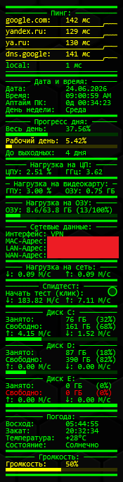

# Rainmeter скин «PCInfo»

## ℹ️ Кастомный конфиг Rainmeter для мониторинга системы:

### 🌐 Сеть
- Пинг до `google.com`, `yandex.ru`, `ya.ru`, `8.8.8.8` (Google DNS) и локального шлюза (в мс, с графиком, цветовая индикация)
- Тип интерфейса (Wi-Fi / Ethernet / VPN)
- MAC-адрес, локальный IP (LAN) и внешний IP (WAN)
- Входящий и исходящий трафик (в Мбит/с)
- Спидтест в один клик (Ookla Speedtest CLI): измеряет скорость скачивания и загрузки
  - Если `speedtest.exe` не найден рядом со скином — скрипт сам скачает и распакует Speedtest CLI с сайта Ookla перед первым запуском

### 🕐 Дата и время
- Дата и время
- Аптайм ПК (дни / часы / минуты / секунды с последней загрузки)
- День недели (с цветовой индикацией: зелёный — будни, жёлтый — суббота, красный — воскресенье)

### 📅 Прогресс дня
- Прогресс всего дня (в %, с баром)
- Прогресс рабочего дня (в %, с баром и цветовой индикацией)
- Дней до выходных

### 💻 ЦПУ
- Нагрузка на процессор (в %, с цветовой индикацией)
- Текущая частота (в ГГц, вычисляется динамически)

### 🎮 ГПУ
- Нагрузка на видеокарту (в %, с цветовой индикацией)
- Использование видеопамяти VRAM (в ГБ)

### 🧠 ОЗУ
- Использование оперативной памяти (занято / всего в ГБ)
- Прогресс-бар с цветовой индикацией

### 🔊 Звук
- Текущая громкость (в %, с баром и цветовой индикацией)
- Клик по строке громкости — выключить/включить звук (mute/unmute)
- Клик по полосе громкости — выставить громкость по позиции клика
- Колёсико мыши над громкостью — изменение громкости на ±5%

### 💾 Диски (C:, D:, E:)
- Занятое и свободное пространство (в ГБ и %)
- Скорость чтения и записи (в МБ/с)
- Прогресс-бар с цветовой индикацией заполненности

### 🌤️ Погода
- Восход и закат солнца
- Текущая температура и состояние погоды
- Город меняется вручную в конфиге (по умолчанию: Ashgabat)

### 🎨 Прочее
- Цветовая логика: зелёный / жёлтый / красный по порогам нагрузки
- Кнопки обновления (клик по разделителям)
- Лёгкий, не нагружает систему

---

## ⚙️ Установка

**Вариант 1 — вручную:**
1. Скопировать папку `PCInfo` в `Documents\Rainmeter\Skins`
2. Перезапустить Rainmeter
3. Активировать скин через диспетчер скинов

**Вариант 2 — автоматически:**
- Установить `PCInfo.rmskin` двойным кликом

---

## 🔧 Настройка

- **Город погоды:** найти строки `wttr.in/City` в `PCInfo.ini` и заменить `City` на нужный город
- **Адрес локального шлюза:** в секции `[MeasurePing5]` (`DestAddress`) заменить `192.168.0.1` на адрес вашего роутера, если он отличается
- **Объём VRAM:** в секции `[MeasureTotalVRAM]` изменить `12` на объём вашей видеопамяти в ГБ
- **Диски:** для добавления/удаления дисков — скопировать или удалить соответствующий блок секций

---

## 🖼️ Скриншот

